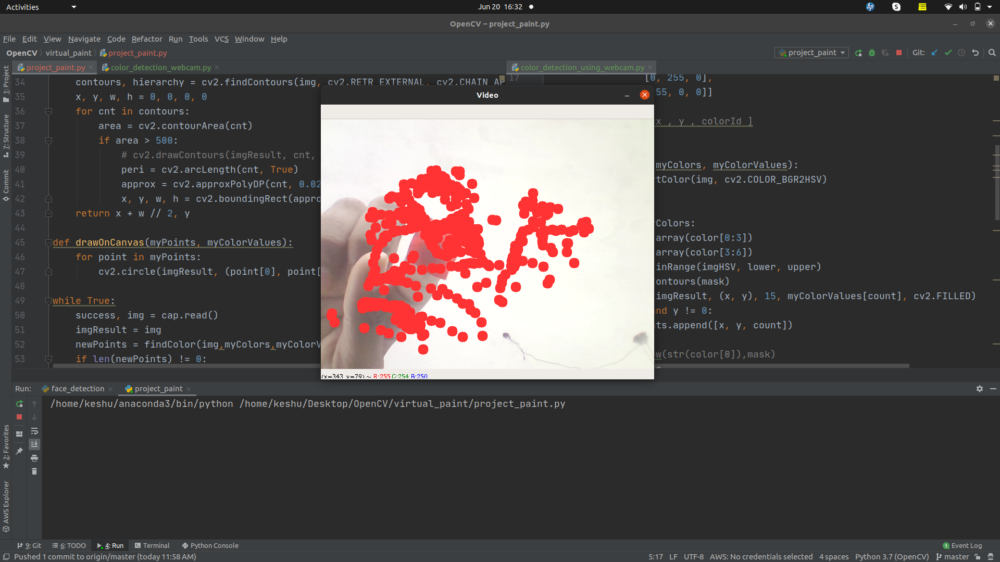
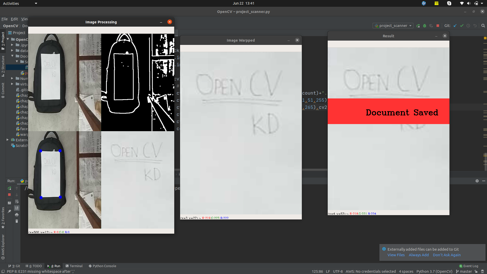

# OpenCV
*Basics of OpenCv using python and based on that some projects.*

## Project 1: Virtual Paint.

**In this [project](https://github.com/03kd/OpenCV/tree/master/virtual_paint), track an object movement, using which a user can draw on the screen by moving the object around.**

## Project 2 : Document Scanner.

**In this [project](https://github.com/03kd/OpenCV/tree/master/Document_Scanner), we use mobile camera through [*IPWEBCAM* app](https://play.google.com/store/apps/details?id=com.pas.webcam&hl=en_IN) as a replacement of webcam.**

